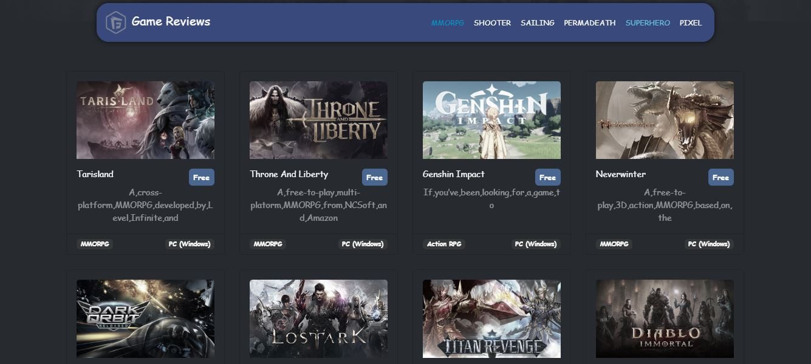

# 🎮 Free-to-Play Games App

## 🔍 Overview

The Free-to-Play Games App is a web-based application that allows users to browse, search, and view detailed information about free-to-play games. The app fetches data from a public API (via RapidAPI) and displays it using a modular, object-oriented JavaScript structure combined with jQuery (if needed) and modern ES6+ features. The user interface is built with HTML5, CSS3, and Bootstrap for responsiveness and visual appeal.

## ✨ Features

- **Display Games List:**  
  Dynamically loads a list of free-to-play games with their thumbnails, titles, short descriptions, genres, and platforms.
  
- **Game Details:**  
  When a game card is clicked, detailed information about the game (including a larger image, full description, and a link to play the game) is fetched from the API and displayed in a dedicated view.
  
- **Responsive Design:**  
  The layout is built using Bootstrap grid and components, ensuring a smooth experience on mobile and desktop devices.
  
- **Modular & Object-Oriented Code:**  
  The project is organized using ES6 classes and modules to separate concerns, such as UI handling (`Ui` class) and game details fetching (`Details` class).

## 🛠️ Technologies Used

- **Vanilla JavaScript (ES6+):**  
  For structuring the app using OOP and modern module syntax.
- **HTML5 & CSS3:**  
  For the core structure and styling of the application.
- **Bootstrap :**  
  For building a responsive layout and UI components.
- **RapidAPI - Free-to-Play Games Database:**  
  For fetching game data (current games and detailed game information).
- **Font Awesome :**  
  For icons used in the UI.

